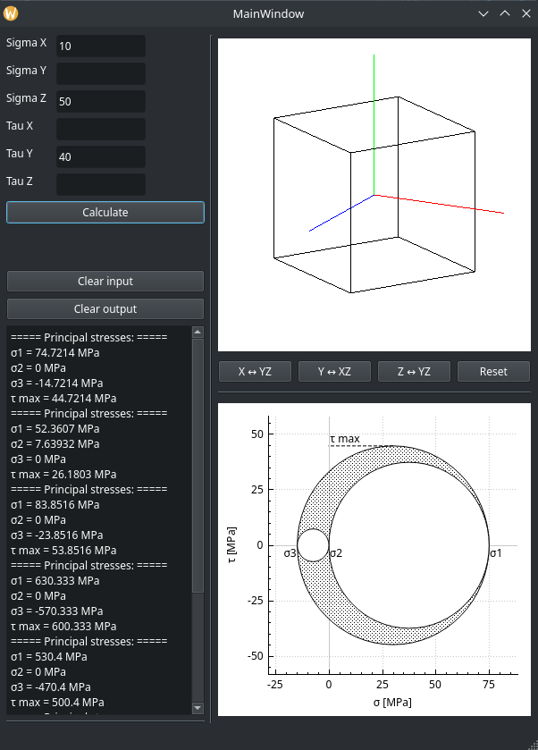
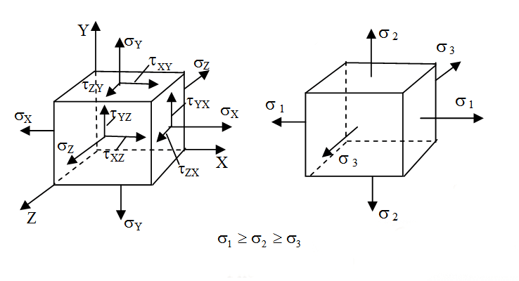
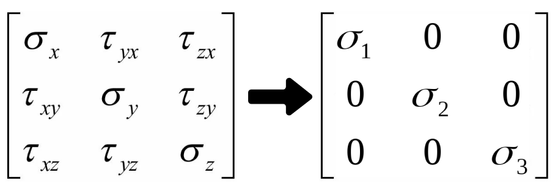

# Principal Stresses
A simple calculator designed to transform a stress tensor into a matrix of principal stresses and visualize principal stress plots.

## Table of Contents

- [Description](#description)
- [Features](#features)
- [Libraries and tools](#libraries-and-tools)
- [Mathematics](#Mathematics)

## Description
This calculator is designed to convert the stress tensor into a principal stress matrix and then visualize the principal stress graphs. It provides an intuitive way to analyze complex stress distributions by breaking them down into more understandable principal stress components, which can be useful for students.

## Features
* Convert stress tensor data into a matrix of principal stresses.
* Visualize and analyze principal stress distributions.
* Simplify the interpretation of stress data by identifying principal stress components.

## Libraries and tools

- [C++, Qt6, OpenGLWidget](https://www.qt.io/product/qt6)
- [Eigen](https://eigen.tuxfamily.org/index.php?title=Main_Page)
- [QCustomPlot](https://www.qcustomplot.com/index.php/support/documentation)

## Mathematics
The stress tensor is presented as a 3x3 symmetrical matrix. Sorting of principal stresses: 

`σ1 > σ2 > σ3`

To calculate the orientation of the main areas, it is necessary to obtain the eigenvectors of each main stress. All three vectors will be mutually orthogonal.

`σ1 -> ν1 = [l, m, n]`

`σ2 -> ν2 = [l, m, n]`

`σ3 -> ν3 = [l, m, n]`

All vectors respect the relationship:

`l^2 + m^2 + n^2 = 1`

